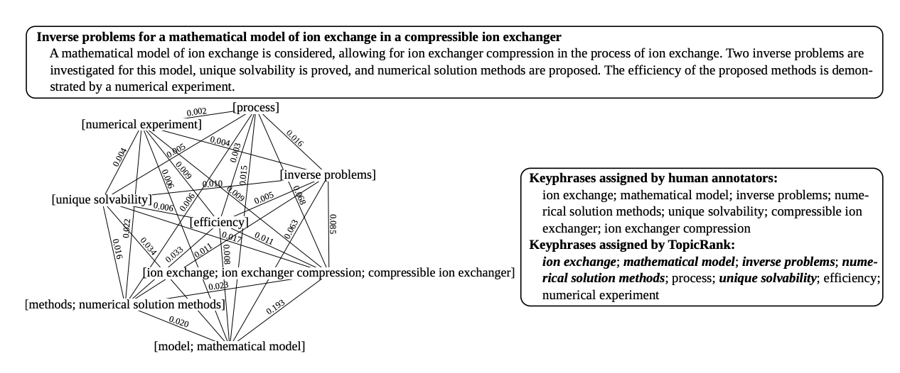

# Grapher

<p align="center">
  
  <br><i>Fig 1: TopicRank visualization (Bougouin et al.,13) </i>
</p>


*Grapher* is a python library for unsurpervised keyword extractions: 
- [Easy interface for keyword extraction with various algorithms via python](#extract-keywords-with-grapher)
- [Quick benchmarking over 16 English public datasets](#benchamrk)
- [Modules to support implementing custom keyword extractor](#implement-custom-method-with-grapher)

## Get Started
Install via pip
```shell script
pip install git+https://github.com/asahi417/grapher
```

or clone and install

```shell script
git clone https://github.com/asahi417/grapher
cd grapher
pip install .
```

## Extract Keywords with grapher
*Grapher* retrieves keywords given a document with various algorithms:
- `FirstN`: a heuristic baseline to pick up first n phrases as keywords 
- `TFIDF`: a simple statistic baseline
- `TextRank`: [Mihalcea et al., 04](https://web.eecs.umich.edu/~mihalcea/papers/mihalcea.emnlp04.pdf)
- `SingleRank`: [Wan et al., 08](https://aclanthology.info/pdf/C/C08/C08-1122.pdf)
- `ExpandRank`: [Wan et al., 08](https://www.aaai.org/Papers/AAAI/2008/AAAI08-136.pdf)
- `TopicalPageRank`: [Liu et al.,10](http://nlp.csai.tsinghua.edu.cn/~lzy/publications/emnlp2010.pdf)
- `TopicRank`: [Bougouin et al.,13](http://www.aclweb.org/anthology/I13-1062)
- `SingleTPR`: [Sterckx et al.,15](https://core.ac.uk/download/pdf/55828317.pdf)
- `PositionRank`: [Florescu et al.,18](http://people.cs.ksu.edu/~ccaragea/papers/acl17.pdf)
- `MultipartiteRank`: [Boudin 18](https://arxiv.org/pdf/1803.08721.pdf)

Basic usage:

```python
import grapher
model = grapher.SingleRank()  # any algorithm listed above
sample = '''
We propose a novel unsupervised keyphrase extraction approach that filters candidate keywords using outlier detection.
It starts by training word embeddings on the target document to capture semantic regularities among the words. It then
uses the minimum covariance determinant estimator to model the distribution of non-keyphrase word vectors, under the
assumption that these vectors come from the same distribution, indicative of their irrelevance to the semantics
expressed by the dimensions of the learned vector representation. Candidate keyphrases only consist of words that are
detected as outliers of this dominant distribution. Empirical results show that our approach outperforms state
of-the-art and recent unsupervised keyphrase extraction methods.
'''
model.get_keywords(sample, n_keywords=2)

[{'stemmed': 'non-keyphras word vector',
  'pos': 'ADJ NOUN NOUN',
  'raw': ['non-keyphrase word vectors'],
  'offset': [[47, 49]],
  'count': 1,
  'score': 0.06874471825637762,
  'n_source_tokens': 112},
 {'stemmed': 'semant regular word',
  'pos': 'ADJ NOUN NOUN',
  'raw': ['semantic regularities words'],
  'offset': [[28, 32]],
  'count': 1,
  'score': 0.06001468574146248,
  'n_source_tokens': 112}]
```

### Algorithm with prior
Algorithms with priors (`TFIDF`, `ExpandRank`, `TopicalPageRank`, `SingleTPR`) need to be trained beforehand:
```python
import grapher
model = grapher.SingleTPR()
test_sentences = ['documentA', 'documentB', 'documentC']
model.train(test_sentences, export_directory='./tmp')
``` 

Priors are cached and can be loaded on the fly:
```python
import grapher
model = grapher.SingleTPR()
model.load('./tmp')
```

### Supported Language
Currently, algorithms are available only in English, but soon we will relax the constrain to allow other language to be supported.
The dependency is mainly due to the Part-of-Speech tagger and the word stemmer.

## Implement Custom Method with grapher
Here is a brief example to create a custom extractor with grapher.

```python
import grapher

class CustomExtractor:
    """ Custom keyword extractor example: First N keywords extractor """

    def __init__(self, maximum_word_number: int = 3):
        """ First N keywords extractor """
        self.phrase_constructor = grapher.PhraseConstructor(maximum_word_number=maximum_word_number)

    def get_keywords(self, document: str, n_keywords: int = 10):
        """ Get keywords

         Parameter
        ------------------
        document: str
        n_keywords: int

         Return
        ------------------
        a list of dictionary consisting of 'stemmed', 'pos', 'raw', 'offset', 'count'.
        eg) {'stemmed': 'grid comput', 'pos': 'ADJ NOUN', 'raw': ['grid computing'], 'offset': [[11, 12]], 'count': 1}
        """
        phrase_instance, stemmed_tokens = self.phrase_constructor.tokenize_and_stem_and_phrase(document)
        sorted_phrases = sorted(phrase_instance.values(), key=lambda x: x['offset'][0][0])
        return sorted_phrases[:min(len(sorted_phrases), n_keywords)]

```

## Benchamrk
We enable users to fetch 16 public keyword extraction datasets via 
[`grapher.get_benchmark_dataset`](./grapher/_get_dataset.py) module.
By which, we provide an [example script](./examples/benchmark.py) to run benchmark over preset algorithms.
All the metrics are in the format of micro F1 score (recall/precision), and model priors are 
computed within each dataset.
Please take a look the result below:

- [***top 5***](./benchmark/full-result.5.csv)
- [***top 10***](./benchmark/full-result.10.csv) 
- [***top 15***](./benchmark/full-result.15.csv)
- [***complexity***](./benchmark/full-result.time.csv) 

To benchmark [custom algorithm](#implement-custom-method-with-grapher), see [the other script](./examples/benchmark_custom_model.py).
